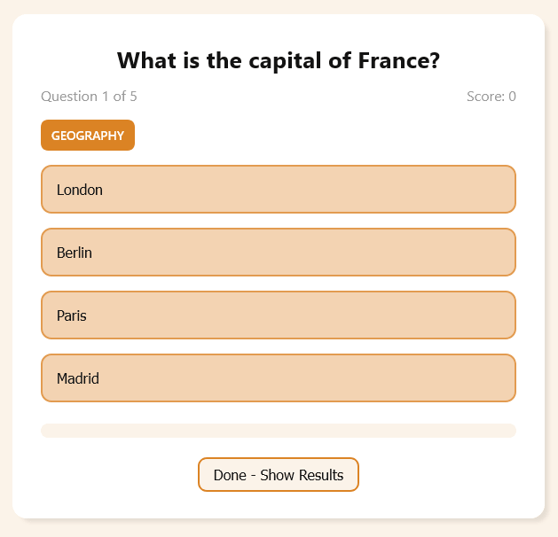
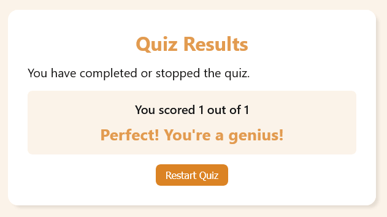
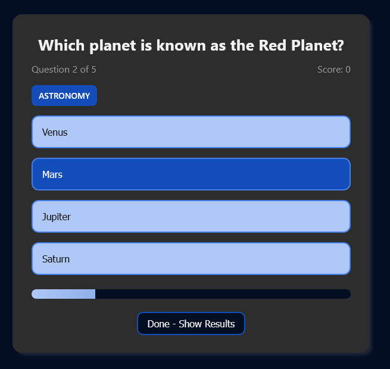

# General Knowledge Quiz Game - FCC

This is a fun general knowledge quiz game project using HTML, CSS, and JS.

# Table of contents

- [General Knowledge Quiz Game - FCC](#general-knowledge-quiz-qame---fcc)
    - [Table of contents](#table-of-contents)
    - [Overview](#overview)
        - [The challenge](#the-challenge)
        - [Screenshots](#screenshots)
    - [My process](#my-process)
        - [Built with](#built-with)
    - [Author](#author)

## Overview

### The challenge

The challenge is to fetch and display an array of questions, one at a time. To display whether the selected answer is correct or incorrect and keep track of the users score. I also wanted to include a theme switcher, so that there is a dark and light mode and this choice is stored locally.

### Screenshots

Welcome Screen

Random Question

Results Page

Dark Mode

## My process

### Built with

- Semantic HTML5 markup
- CSS custom properties
- CSS Flex
- Javascript

## Author

- [@davejnicol](https://github.com/davejnicol)
